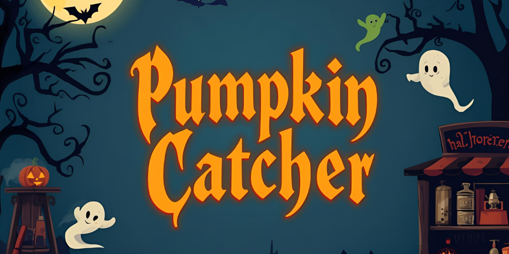

# 🎃 Hi, Halloween: Pumpkin Catcher! — мини-игра  

Мини-игра к Хэллоуину от **ОНЛАЙНТРЕЙД.РУ**.  
Лёгкая, атмосферная и весёлая HTML5-игра прямо в браузере.  
Ваша цель проста: **ловите тыквы и конфеты**, избегайте **пауков, паутины и привидений**.  
Соберите **100 🎃** — и Джек откроет секретную награду!  

  👉 [Играть в Hi Halloween](https://annyaromanova-del.github.io/-Hi-Halloween-Pumpkin-Catcher-/)  

---

## 🕹 Управление  

- 📱 **На телефоне:** водите корзину пальцем по экрану.  
- 🖥 **На компьютере:** двигайте корзину мышкой.  

---

## 📸 Скриншоты  

(./skrin_baza.jpg) (./skrin_ais.jpg) (./skrin_mobail.jpg)
---

## ⚡ Технологии  

- **HTML5 Canvas**  
- **Vanilla JavaScript** (без фреймворков)  
- **GitHub Pages** — публикация и хостинг  

---

## 💼 Брендирование  

Проект создан как праздничная мини-игра для компании **ОНЛАЙНТРЕЙД.РУ**.  
Логотип используется исключительно в рамках брендированной версии игры и не подлежит изменению или удалению.  
Визуальный стиль, персонажи и элементы интерфейса являются частью фирменного дизайна.  

---

## 📜 Лицензия  

Игра **🎃 Hi, Halloween: Pumpkin Catcher!** распространяется по лицензии  
**[Creative Commons Attribution-NonCommercial-NoDerivatives 4.0 International (CC BY-NC-ND 4.0)](https://creativecommons.org/licenses/by-nc-nd/4.0/)**  

Это означает:  
- можно делиться игрой и ссылками на неё,  
- нельзя изменять дизайн, убирать логотип **ОНЛАЙНТРЕЙД.РУ** или использовать игру в коммерческих целях,  
- при публикации необходимо сохранять имя автора и ссылку на источник.  

© 2025 **Анна Романова / Онлайнтрейд.ру**  
🎮 Мини-игра к Хэллоуину. Лови тыквы и конфеты, избегай пауков и привидений!
